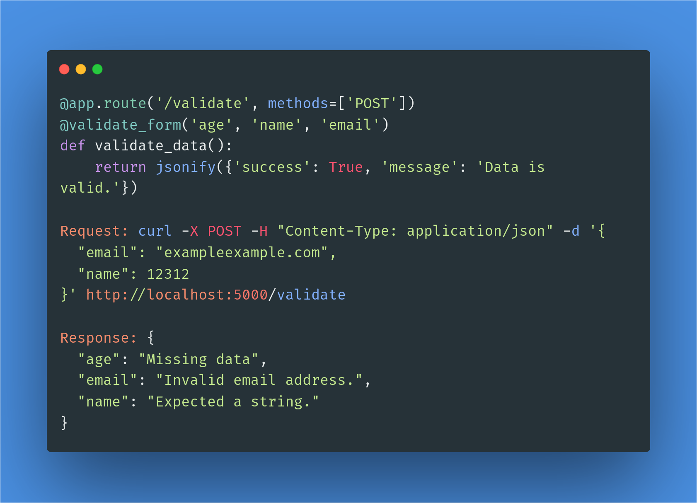

# Flask Validator

Flask Validator is a powerful package designed to simplify data validation in Flask applications. It provides an easy-to-use interface for defining data validation rules and seamlessly integrates with Flask routes using a custom decorator.

* **Simplified Data Validation:** Flask Validator streamlines the process of validating data in Flask applications, reducing the complexity and boilerplate code.
* **Integration with Flask Routes:** The package seamlessly integrates with Flask routes through a custom decorator, making it easy to apply validation rules to specific endpoints.
* **Flexible Validation Schema:** Flask Validator allows you to define validation rules using a schema structure, providing a clear and organized way to specify the expected data format.
* **Custom Validators:** You can create custom validators to extend the validation capabilities of Flask Validator, enabling you to implement complex validation logic tailored to your application's needs.
* **Error Handling:** Flask Validator automatically generates error messages based on the defined validation rules, simplifying the process of handling validation failures and providing 

<p align="center">
  
</p>

With the help of Flask Validator, you can ensure the integrity and consistency of the data submitted to your Flask endpoints, enhancing the reliability and security of your application.

## How It Works

1. Flask Validator provides a custom decorator, @validate_form, which can be applied to Flask routes.
2. The decorator takes a validation schema as its argument, defined using the Schema class and Field class from Flask Validator. 
3. The validation schema specifies the structure of the expected data and the validation rules for each field.
4. When a request is made to a decorated route, Flask Validator automatically validates the incoming data based on the defined schema.
5. If the data passes the validation, the route handler function is executed as usual.
6. If the data fails the validation, Flask Validator generates error messages based on the defined rules and returns a response with the error details.

## Usage
To use Flask Validator in your Flask application, follow these steps:

### Installation
You can install Flask Validator using pip:

```
pip install flask_validators
```

### Getting Started
1. Import the necessary modules and classes from Flask Validator:
```python
from flask import Flask, request, jsonify
from flask_validators import validate_form
```

2. Create a Flask application instance:
```python
app = Flask(__name__)
```

3. Define a route with the @validate_form decorator and specify the validation schema:
```python
@app.route('/validate', methods=['POST'])
@validate_form('age', 'name', 'email')
def validate_data():
    return jsonify({'success': True, 'message': 'Data is valid.'})
```

4. Run the Flask application:
```python
if __name__ == '__main__':
    app.run(debug=True)
```

Now, when a POST request is made to the /validate endpoint, Flask Validator will automatically validate the incoming data based on the specified schema. The @validate_form decorator is used to validate the fields 'age', 'name', and 'email'. If the data passes the validation, the route handler function (validate_data in this case) will be executed. Otherwise, Flask Validator will generate error messages and return a response with the error details.

You can also define Validators with specific requirements
```python
@app.route('/validate', methods=['POST'])
@validate_form(
    Schema({
        'email': Field(required=True, type='string', validators=[
            {'name': 'email', 'message': 'Invalid email address.'}
        ])
    })
)
def validate_data():
    return jsonify({'success': True, 'message': 'Data is valid.'})
```

## Validation Schema
The validation schema is defined using the Schema class, which takes a dictionary representing the schema structure. Each field in the schema is associated with a set of validation rules.
For example, the following schema validates an email field:
```python
Schema({
    'email': Field(required=True, type='string', validators=[
        {'name': 'email', 'message': 'Invalid email address.'}
    ])
})
```
In the example above, the email field is marked as required and expects a string value. It also applies an additional validator to check if the value is a valid email address.

## Validation Rules
Validation rules are defined using the Field class. Each field can have properties such as required (indicating if the field is required), type (specifying the expected data type), and validators (a list of additional validators to apply).

The Field class also provides built-in validation methods, such as validate_email, validate_age, validate_name, validate_password, and validate_json. These methods can be used directly or extended to implement custom validation logic.

## Custom Validators
Flask Validator allows you to create custom validators to implement complex validation logic tailored to your application's needs. To create a custom validator, define a method within the Schema class that follows the validate_<validator_name> naming convention. This method should accept the field value and any additional arguments defined in the validation rule. It should return a tuple with a boolean indicating the validation result and an error message if the validation fails.

For example, to create a custom validator named validate_custom, add the following method to the Schema class:
```python
def validate_custom(self, value, argument1, argument2, ...):
    # Validation logic
    if valid:
        return True, None
    else:
        return False, 'Validation failed.'
```

## Currently Working
Currently I am working on database integration support, any help will be appreciated

## Error Handling
If validation fails, Flask Validator automatically generates error messages based on the defined validation rules. The error response includes a JSON object with the field names as keys and the corresponding error messages as values. This makes it easier to handle validation failures and provide meaningful feedback to the users.

## Error Handling
If validation fails, Flask Validator automatically generates error messages based on the defined validation rules. The error response includes a JSON object with the field names as keys and the corresponding error messages as values. This makes it easier to handle validation failures and provide meaningful feedback to the users.